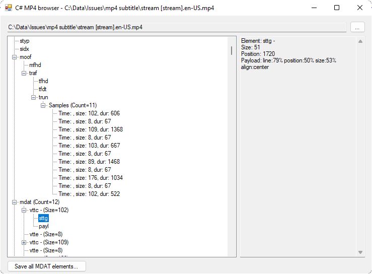

# Mp4Browser

MP4 browser for debugging/inspecting mp4 files.

Written in C#/.NET 4.8/Winforms

Has support for these boxes:
* mdat
* mdhd
* mdia
* minf
* moof
* moov
* mvhd
* sidx
* stbl
* stsd
* tfdt
* tkhd
* traf
* trak
* trun
* vttc

